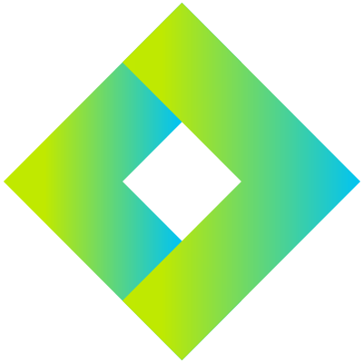

# 🎧 E-commerce JBL Experience

> Proyecto desarrollado como trabajo integrador del bootcamp de React.js en Coderhouse. Esta versión del README está orientada a presentar mi trabajo a potenciales empleadores.

## 👨‍💻 Sobre mi aporte
- Diseño e implementación de una **Single Page Application** en React para una tienda oficial de productos JBL.
- Configuración del proyecto con **Vite** y estructuración modular de componentes reutilizables.
- Desarrollo de un **carrito de compras con contexto global**, control de stock dinámico y notificaciones de interacción.
- Integración completa con **Firebase Firestore** para obtener el catálogo en tiempo real y centralizar la data del proyecto.
- Creación de **experiencias visuales atractivas**: carruseles de productos, banners promocionales y navegación responsive con Bootstrap.
- Automatización de utilidades (helpers, hooks personalizados) para optimizar la gestión del catálogo y el checkout.

## 🌟 Highlights del producto
- Catálogo dinámico segmentado por categorías y fichas de detalle individuales.
- Flujo de compra con actualización de totales, manejo de stock y feedback visual inmediato.
- Navegación por rutas protegidas con React Router y preservación del estado con Context API.
- Animaciones y microinteracciones con librerías externas para mejorar la experiencia del usuario.


## 🛠️ Tecnologías principales
<div align="center">
    <table>
        <tr>
            <td align="center"><br/>React</td>
            <td align="center"><br/>Vite</td>
            <td align="center"><br/>JavaScript</td>
            <td align="center"><br/>HTML5</td>
            <td align="center"><br/>CSS3</td>
        </tr>
        <tr>
            <td align="center"><br/>Sass</td>
            <td align="center"><br/>Bootstrap 5</td>
            <td align="center"><br/>Firebase</td>
            <td align="center"><br/>Splide.js</td>
            <td align="center"><br/>npm</td>
        </tr>
        <tr>
            <td align="center"><br/>Git</td>
            <td align="center"><br/>React Router</td>
            <td align="center"><br/>GitHub</td>
            <td align="center"><br/>Animate.css</td>
            <td align="center"><br/>Toastify</td>
        </tr>
    </table>
</div>

## 🧩 Arquitectura y organización
- **Componentes atómicos** en `src/components` para secciones clave como Home, Catálogo, Cart y CheckOut.
- **Contexto global** en `src/context/CartContext.jsx` que centraliza catálogo, stock, carrito y totales.
- **Hooks y utilidades personalizadas** en `src/hooks` y `src/js/functions.js` para encapsular lógica compartida.
- **Estilos modulares** con `Sass` y `CSS` para mantener coherencia visual y facilitar el mantenimiento.
- **Configuración de Firebase** en `src/main.jsx` para inicializar el SDK y habilitar la conexión con Firestore.

## 🚀 Cómo ejecutarlo
```bash
npm install
npm run dev
```

## 📸 Vistas destacadas
- Hero principal con carrusel promocional y CTA.
- Listados por categoría con Splide.js y filtros dedicados.
- Checkout con resumen dinámico del pedido y formulario de contacto.

## 📬 Contacto
Si te interesa conocer más sobre este proyecto o mis próximas colaboraciones, podemos hablar en [LinkedIn](https://www.linkedin.com/in/marco-vizgarra-777a7a255/).